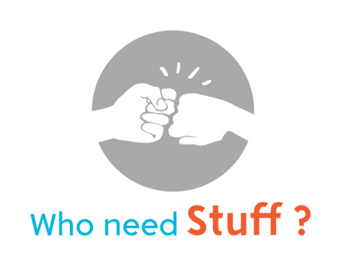

# ionic-whoneedstuff-app 

Aplicativo desenvolvido para o The Big Hackaton na Campus Party 2017 - #cpbr10"

Aplicativo está disponível atualmente na plataforma Android.

### Executável

Para baixar o executável `.apk`, use o link: [Baixar o aplicativo](https://drive.google.com/file/d/0B4d4_SUk6fVQY1UtV3ZIQ0ltTTg/view)

O Executável também está disponível na pasta  `executavel` dentro do projeto, 
para baixá-lo, clone o projeto e copie esse arquivo para o seu celular.

### Login

Atualmente há duas opções de login, logins para usuários doador e donatário

##### Logar como doador
`usuário :  doador`

`senha :  <qualquer - pode se deixar o campo em branco>`

##### Logar como donatário
`usuário :  ong`

`senha :  <qualquer - pode se deixar o campo em branco>`

---

ps. O applicativo foi desenvolvido em 36 horas durante o Hackaton e não foi atualizado após o evento, caso você queira melhorá-l0, sinta-se a vontade para fazer o seu "fork"  e criar pull-requests.

